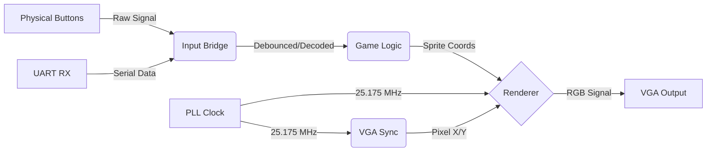

<div align="center">

# FPGA Pong Console


**A dedicated Pong game console built in Verilog, designed for 640x480 @ 60Hz VGA output with low-latency hardware controls.**

</div>

## Overview

This project implements a complete Pong game console on the Intel Cyclone IV FPGA. Unlike software-based emulators, this system renders graphics and calculates physics directly in hardware using custom digital logic circuits.

The design features a 60Hz VGA display driver, hardware collision detection, 2-digit scorekeeping, and a state-machine-driven menu system. It includes a custom AI opponent with dynamic difficulty scaling and supports external input via UART for connecting keyboards or PS4 controllers.

## System Architecture

The design separates game logic, rendering and input bridging similar to the separation of CPU, GPU, and I/O controllers in modern consoles.



## Features

* Hardware-based physics engine handling collision detection between the ball, paddles, and walls.
* An adaptive AI opponent with dynamic difficulty scaling that adjusts aiming accuracy based on the current score difference.
* Support for both onboard physical pushbuttons and external UART input (Keyboard/PS4 controller) via a custom Python driver.
* Integrated start menu system for selecting between Singleplayer and Multiplayer game modes.
* Font Rendering using a custom Python metaprogramming script (`software/gen_font.py`) that generates Verilog Font ROMs from `.otb` bitmap font files.
* A scoreboard rendering system to keep track of player scores.

## AI Mechanics

The single-player mode features an AI opponent designed to keep the game engaging. Instead of simply changing speed, the AI adjusts its targeting accuracy.

The AI tracks the ball's trajectory and calculates a target interception point. A pseudo-random number generator (using a linear feedback shift register) adds an error offset to this target.
* If the player is leading, the error offset decreases proportionally to the score difference.
* If the AI is leading, the error offset increases proportionally to the score difference.

This creates a natural difficulty curve where the AI plays harder when threatened but gives the player a chance to recover when behind.

## Hardware Implementation

The project was originally designed for the Intel Cyclone IV EP4CE6E22C8N FPGA on the RZ-EasyFPGA A2.2 / RZ-EP4CE6-WX board by Ruizhi Technology Co, but can be reused for a variety of boards. Output is driven via the onboard VGA port to a standard monitor using a VGA-to-HDMI adapter. Serial communication is driven via a USB-to-Serial converter, where a Python script handles forwarding inputs via keyboard and PS4 controller. 

* FPGA: [Intel Cyclone IV EP4CE6E22C8N](https://www.intel.com/content/www/us/en/products/sku/210472/cyclone-iv-ep4ce6-fpga/specifications.html)
* FPGA Development Board: [RZ-EasyFPGA A2.2 / RZ-EP4CE6-WX board](https://web.archive.org/web/20210128152708/http://rzrd.net/product/?79_502.html)
* USB to Serial Adaptor: [Duinotech Arduino Compatible USB to Serial Adaptor](https://www.jaycar.com.au/duinotech-arduino-compatible-usb-to-serial-adaptor/p/XC4464)
* VGA-to-HDMI Adapter: [eBay Listing](https://www.ebay.com.au/itm/302905294205)
* Monitor: [Dell 24 200Hz Monitor SE2425HG](https://www.dell.com/en-au/shop/dell-24-200hz-monitor-se2425hg/apd/210-bsgw/computer-monitors)

### Pinout Configuration

| Signal Name | FPGA Pin | Description |
| :--- | :--- | :--- |
| `sys_clk` | **PIN_23** | 50MHz Master Clock |
| `rst` | **PIN_25** | Reset Button (Active Low) |
| `uart_rx` | **PIN_114** | Serial Receive |
| `button[0]` | **PIN_88** | Player 1 Up |
| `button[1]` | **PIN_89** | Player 1 Down |
| `button[2]` | **PIN_90** | Player 2 Up |
| `button[3]` | **PIN_91** | Player 2 Down |
| `h_sync` | **PIN_101** | Horizontal Sync |
| `v_sync` | **PIN_103** | Vertical Sync |
| `red` | **PIN_106** | Red Channel (1-bit) |
| `green` | **PIN_105** | Green Channel (1-bit) |
| `blue` | **PIN_104** | Blue Channel (1-bit) |

### Controls

| Action | Player 1 (Left) | Player 2 (Right) | Menu Navigation |
| :--- | :--- | :--- | :--- |
| **Move Up** | Left Stick / `W` | Right Stick / `Up Arrow` | `W` / Left Stick |
| **Move Down** | Left Stick / `S` | Right Stick / `Down Arrow` | `S` / Left Stick |
| **Start Game** | Any Key | Any Key | Any Key |

## Directory Structure

```text
├── quartus/               # Quartus Prime project files
├── rtl/
│   ├── core/              # Reusable System IPs (VGA, Fonts, PLL)
│   ├── game/              # Pong Logic & Rendering
│   │   ├── pong_engine_top.v  # <--- Top Level Module (Set as Top Entity in Quartus)
│   │   └── ...
│   └── inputs/            # Button Debouncers & Input Drivers
└── software/
    ├── gen_font.py        # Font/ROM generation script
    └── uart_driver.py     # Keyboard/PS4 input driver
```

## Credits
- [uart_rx](rtl/inputs/uart_rx.v) implements Ben Marshall's [UART repository](https://github.com/ben-marshall/uart/tree/master).
- The AI opponent's dynamic difficulty scaling was inspired by Jake Gordon's implementation of [Javascript Pong](https://github.com/jakesgordon/javascript-pong)
