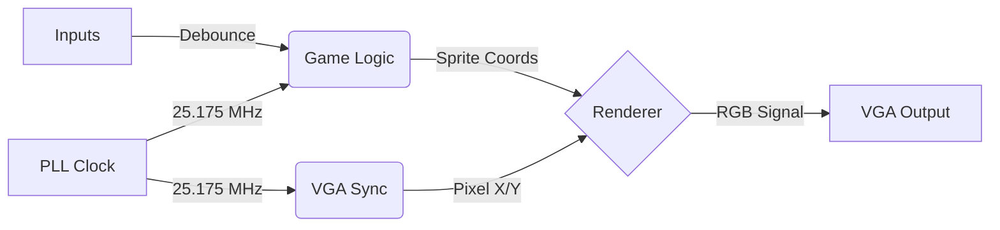

<div align="center">

# FPGA Pong Console


**A dedicated Pong game console built in Verilog, designed for 640x480 @ 60Hz VGA output with low-latency hardware controls.**

</div>

## Overview

This project implements a complete Pong game console on the Intel Cyclone IV FPGA. Unlike software-based emulators, this system renders graphics and calculates physics directly in hardware using custom digital logic circuits.

The design features a 60Hz VGA display driver, collision detection, 2-digit scorekeeping, and a state-machine-driven menu system. It is built to be modular, separating the reusable VGA core from the specific game logic to allow for future modifications.

## System Architecture

The design uses a separated "Game Logic" and "Renderer" architecture, similar to the separation of CPU and GPU in modern consoles.



## Components

1. **`pong_engine_top.v`** is the top-level module. It instantiates the PLL, interconnects the Game Engine with the Renderer, and maps internal signals to the FPGA's physical I/O pins.
2.  **`pong_logic.v`** acts as the "CPU" of the console. It handles 2D velocity vectors, wall/paddle collision checks, score tracking (up to 11), and the game state machine (Startup -> Active -> Game Over).
3.  **`pong_renderer.v`** acts as the "GPU" of the console. It performs real-time sprite compositing, drawing the ball, paddles, net, and score digits based on the current pixel coordinate.
4.  **`rtl/core/`** contains reusable modules including the Sync Generator (`vga_sync.v`) and Font ROM drivers for displaying text.
5.  **`rtl/inputs/`** contains hardware debouncers that filter noise from physical buttons before passing signals to the game logic.

## Features

* Collision detection between the ball, paddles and walls.
* Safety timer to prevent "instant-start" glitches caused by button settling times on power-up.
* Font Rendering using a custom Python metaprogramming script (`software/gen_font.py`) that generates Verilog Font ROMs from `.otb` bitmap font files.
* A scoreboard rendering to keep track of player scores.

## Hardware Implementation

The project was originally designed for the Intel Cyclone IV EP4CE6E22C8N FPGA on the RZ-EasyFPGA A2.2 / RZ-EP4CE6-WX board by Ruizhi Technology Co, but can be reused for a variety of boards. Output is driven via the onboard VGA port to a standard monitor using a VGA-to-HDMI adapter.

* FPGA: [Intel Cyclone IV EP4CE6E22C8N](https://www.intel.com/content/www/us/en/products/sku/210472/cyclone-iv-ep4ce6-fpga/specifications.html)
* FPGA Development Board: [RZ-EasyFPGA A2.2 / RZ-EP4CE6-WX board](https://web.archive.org/web/20210128152708/http://rzrd.net/product/?79_502.html)
* VGA-to-HDMI Adapter: [eBay Listing](https://www.ebay.com.au/itm/302905294205)
* Monitor: [Dell 24 200Hz Monitor SE2425HG](https://www.dell.com/en-au/shop/dell-24-200hz-monitor-se2425hg/apd/210-bsgw/computer-monitors)

### Pinout Configuration

| Signal Name | FPGA Pin | Description |
| :--- | :--- | :--- |
| `sys_clk` | **PIN_23** | 50MHz Master Clock |
| `rst` | **PIN_25** | Reset Button (Active Low) |
| `button[0]` | **PIN_88** | Player 1 Up |
| `button[1]` | **PIN_89** | Player 1 Down |
| `button[2]` | **PIN_90** | Player 2 Up |
| `button[3]` | **PIN_91** | Player 2 Down |
| `h_sync` | **PIN_101** | Horizontal Sync |
| `v_sync` | **PIN_103** | Vertical Sync |
| `red` | **PIN_106** | Red Channel (1-bit) |
| `green` | **PIN_105** | Green Channel (1-bit) |
| `blue` | **PIN_104** | Blue Channel (1-bit) |

## Directory Structure

```text
├── quartus/               # Quartus Prime project files
├── rtl/
│   ├── core/              # Reusable System IPs (VGA, Fonts, PLL)
│   ├── game/              # Pong Logic & Rendering
│   │   ├── pong_engine_top.v  # <--- Top Level Module (Set as Top Entity in Quartus)
│   │   └── ...
│   └── inputs/            # Button Debouncers & Input Drivers
└── software/              # Python script for font/ROM generation
```
